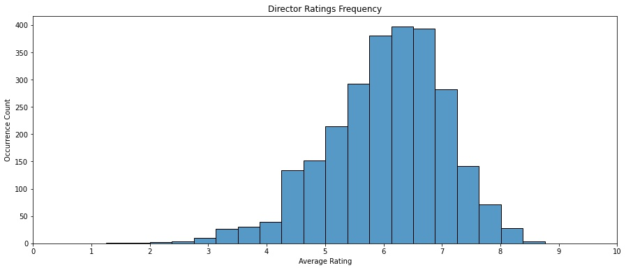
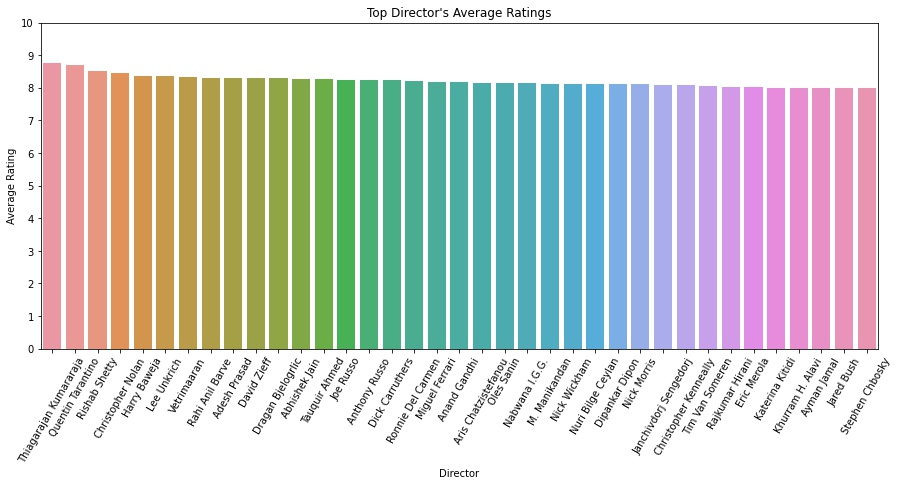
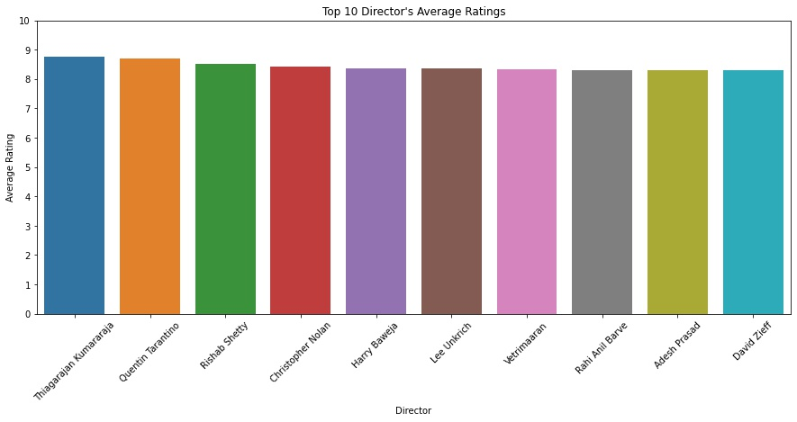
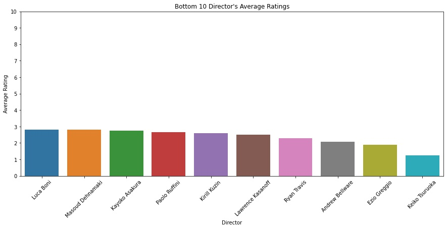
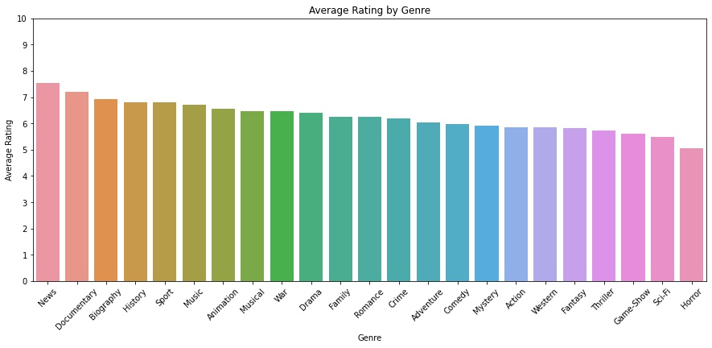
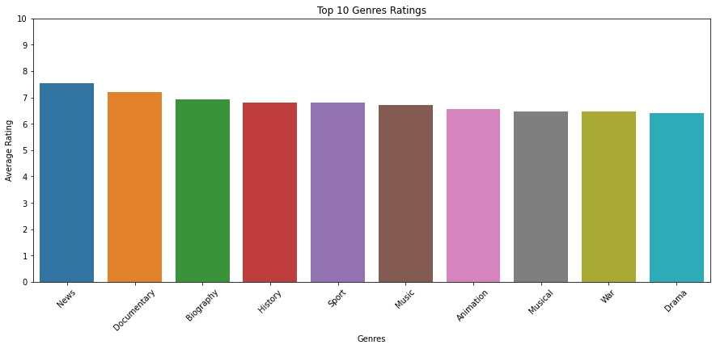
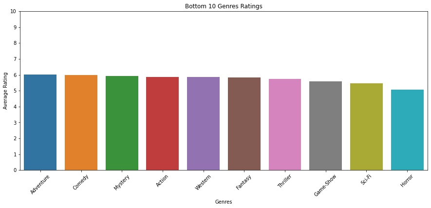
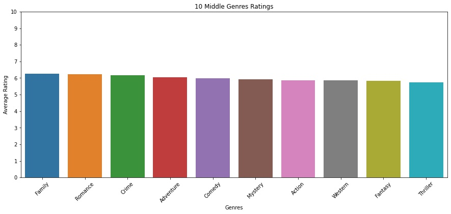

# Microsoft Movie Studios: Movie Analysis
Authors: Imani Thompson and Phil Lannoo 
# Overview
This project analyses which directors and genres Microsoft Movie Studios should consider when producing movies based on the ratings each recieved. Descriptive analysis of IMDb movie data shows that some directors have higher ratings on their movies compared to others and certain genres also have higher ratings. Microsoft movie studios can use these findings to hire outstandings directors to produce movies that everyone will enjoy.
# Business Understanding
Microsoft Movie Studios is looking to enter the industry to quickly become the most used streaming service. Microsoft has no restrictions on the costs or time that this will be required but is more concerned with providing their clients. We are supplying Microsoft Movie Studios with a pathway for sucess that leads to what they are looking for.
# Data 
We used data taken from IMDB which ranged from 2010 to 2019. This data included movie titles, release year, genres the movie falls under, average rating of IMDB votes on that movie, number of people who voted, directors, writers, and other people involved with the making of the movie, as well as birth and death year and primary professions for each of those people.
# Results
After cleaning, filtering, and analyzing the data, we decided on using 3 primary metrics to determine what microsoft should do. We looked at average ratings across a director's filmography, average rating across genres, and genres a director has worked within.
## Directors
The distribution of ratings among directors is close to being a normal distribution.

The ratings of most directors fall within the range of 6 to 7. What this tells us is that directors rated above 7 can be considered good directors, while directors rated above 8 can be considered exceptional.

Looking at those exceptional directors who average higher than an 8 gives us 37 results.

These results show little variation outside of the top 5, the middle of the pack don't differ greatly from each other within the given range.

With that in mind, the top 10 highest rated directors are below.

The top 4 show decent variation between themselves, the all of the lower directors sit at similar values here, not varying greatly.

While we're looking at directors, let's also look at the bottom 10 to see how low they fall on the scale in comparison to the top.

This shows that the variance among directors is large enough that you'll want to consider only highly rated directors, rather than hiring whoever is available.

## Genres
We've looked at directors, now let's take a look at the average rating of all movies within each genre (note: many movies fall into more than one genre, and so were counted repeatedly in the below graphs).

Looking at this, we see a few top genres that stand out, and a few low genres that stand out; however the middle genres are quite unremarkable.

Let's take a closer look at the top genres.

Again we see the top 3 or 4 have mild variation, while the lower end still doesn't show much variation at all.

And let's look at the bottom genres.

Again we see very little variation in the genres toward the middle, so let's take a look at the genres actually in the middle now.

So this may tell us genre isn't as relevant as we had assumed, but it should still play a factor; looking at what genres a director works in, and avoiding directors who primarily work within the bottom 4 genres will be beneficial. Outside of the bottom 4, the genre may not play a heavy role; so it's likely best to consider what genres a director works in and let them stick to those.
# Conclusions
This Data analysis leads to three recommendations that will allow Microsoft Movie Studios to come out as being the most popular streaming service in business:
- Look to hire directors who have made at least 5 productions that have high ratings.
    - Directors who are dominating in the film industry are more likely to provide you with well loved movies.
- Focus on hiring directors that have a high ranking
    - An average ranking of 8.0 or higher leaves 37 options, 7.0 or higher leaves 428 options.
- Let the directors work in genres they've done well in in the past.

# Next Steps
Future ideas for an continuation of this project:
- Look at addition metrics for movie actors 
    - Having well known experienced actors would be a benefit that would lure people to these movies.
- Look at addition metrics for movie writers
    - Yes, directors are important since they have control but writers are the people who create the piece from scratch. Involving writers would also be beneficial.
- Look at coinciding genres
    - This project focused on individual genres so considering that many movies are associaed with more than one genres, looking at grouped genres would give another view. 